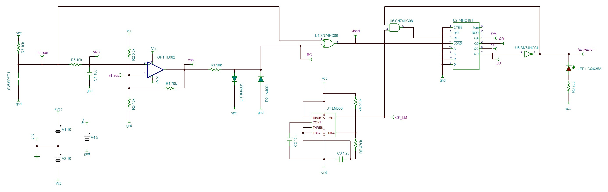

# UMA-non-motion-trigger
Proyecto para la UMA. Pulsera que activa un LED tras un periodo de inactividad de un sensor de movimiento. :octocat:
## Motivación
Las personas mayores son muy vulnerables. Este proyecto está pensado como prototipo de una pulsera que las personas mayores puedan llevar en la muñeca o como brazalete y que alerte ante el evento de una caida y, proporcionarles así, ayuda con la mayor urgencia posible.
## Cambios en el diseño
Inicialmente se piensa en este dispositivo como un dispositivo IoT implementado con un microcontrolador ESP32. Este se conecta a WiFi y mediante un sensor acelerómetro envía una señal de alerta cuando se produce un movimiento excesivamente brusco.

Para ajustarse al contenido de la asignatura de Tecnología Electrónica, se realiza varios cambios en el diseño de este dispositivo:
- Limitación: Busca realizar el dispositivo con integrados digitales y analógicos. Eliminando la presencia del microcontrolador.
- Simplificación: Cambia el sensor acelerómetro por un tilt sensor.

## Diseño
Usa 4 bloques diferenciados:
- Generador de pulsos. Tiene por entrada la señal del sensor. Dentro de este deferencia dos bloques funcionales:
	- Circuito RC.
	- Operacional con conf. trigger-schmitt.
- Reloj rápido.
- Contador.
- Astable. Para el flash del LED.

Se escoge tecnología CMOS para la implementación de este proyecto.
## Esquematico
El esquematico del proyecto general, al que se ha llamado ROOT.TSC es este:


## Lista de componentes
Lista de componentes que se debe comprar para la realización de este proyecto:
- [ ] 74HC191	x 1
- [ ] 74HC04	x 1
- [ ] 74HC08	x 1
- [ ] 74HC86	x 1
- [ ] 510k resistor	x 1
- [ ] 470k resistor	x 1
- [ ] 10k resistor	x 4
- [ ] 70k resistor	x 1
- [ ] 5.6k resistor	x 1
- [ ] 230 resistor	x 1
- [ ] 1N4001	x 2
- [ ] TL082	x 1
- [ ] LM555	x 1
- [ ] 10n capacitor	x 2
- [ ] 1u capacitor	x 1
- [ ] LED, red		x 1

## Justificación de los componentes
En este apartado se describe con detalle los motivos que han llevado a escoger los modelos de integrados entre otros modelos. Antes de empezar se debe comentar que este se trata de un prototipado. Por lo que por simplicidad del proyecto se han procurado escoger componentes con los que se encuentra el diseñador familiarizado. Por otro lado, se ha escogido tecnología CMOS de alta velocidad.
### 74HC191 : contador 4 bits
Este es un contador de 4 bits con una entrada /LOAD asíncrona, activa a nivel bajo --> Según la hoja de características necesita un ancho de pulso de 16 ns con ``Vcc=4.5V`` para tener la certeza de que se ha introducido el valor del preset en la cuenta. Este es un tiempo muy reducido, aún así, tendremos que procurar que se cumpla este tiempo en nuestra señal /LOAD cada vez que queramos realizar el reseteo de la cuenta.
El valor de preset que introducimos es el ``0000``. Junto con la señal D/U y /CTEN a nivel bajo permitimos el avance de la cuenta.
## Calculo de frecuencia del LM555_astable
Este componente tiene dos dos resistencias (típicamente llamadas ``RA`` y ``RB``) y un condensador ``C``. Esta configuración funciona como un multivibrador. El condensador ``C`` se carga a través de ``RA + RB`` y se descarga a través de ``RB``. La relación entre estas dos resistencias dará el ciclo de trabajo de la señal de salida.
Lo primero que se debe saber es el periodo de reloj que se necesita --> Se supone que 10 segundos sin señal del sensor es suficiente para tener que activar la alarma. Esta activación viene dada por el MSB del contador. Antes ha tenido que pasar por varios valores
```
0000
0001
0010
0011
0100
0101
0110
0111
```
8 valores que se reparten en 10 segundos : Tenemos un frecuencia de reloj de 0.8 Hz.
Si observamos la hoja de caracteristicas del LM555 podemos ver, en la **figura 16**, para una frecuencia de 0.8 Hz, con un condensador de 1 uF, nos sale una resistencia ``RA + 2RB`` algo mayor de 1 Mohm. Podremos realizar un ajuste fino en la simulación. Una vez hecho este ajuste obtenemos los siguientes resultados:
```
C = 1u
RA = 510k
RB = 470kM
```
**NOTA : Estos valores de resistencias son ya valores comerciales**